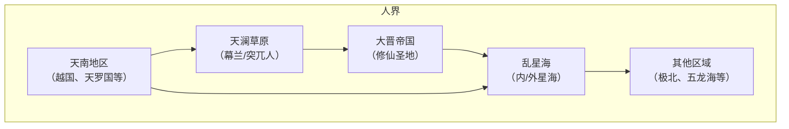

好的，为你整理了这份比上一轮更系统的《凡人修仙传》世界观设计大纲，希望能帮你更全面地理解这个世界。

---

### 《凡人修仙传》世界观设计大纲文档

#### 一、 基础架构：界面体系

故事世界分为**下位界面**、**中位界面**和**上位界面**，空间尺度与灵气浓度呈几何级增长。

##### 1. 人界（下位界面）
*   **定位**：凡人修仙的起点，灵力相对稀薄，是人界、灵界、仙界三层结构中最低的一层。
*   **构成**：并非星球的形态，而是一块辽阔的天地，由天南、乱星海等数个彼此隔绝的地理区域组成。
*   **连接**：对外分布着无数个类似人界的下位界面，它们如同球体一样嵌套在灵界中，但与灵界有空间壁垒隔绝。

##### 2. 灵界（中位界面）
*   **定位**：中阶修仙者的活动舞台，灵力充沛，是人界修士飞升后的目的地。
*   **构成**：疆域极为辽阔，人界加起来都不及其一块大陆的面积。主要由**风元、雷鸣、血天**三块大陆及周围的**蛮荒之地**组成。
*   **连接**：拥有链接人界的飞升通道，同时也是魔界入侵的战场。

##### 3. 仙界（上位界面）
*   **定位**：修仙的终极之地，灵气浓郁，灵界大乘期渡劫后可飞升至仙界。
*   **构成**：由无数仙域构成，地域更为恢弘，包含**36顶级大域、500中域、3000小域**，以及无数未名仙域。主角韩立的主要活动轨迹就在北寒仙域、黑土仙域等地。

##### 4. 其他界面
*   **魔界**：与灵界并行，充斥着魔气而非灵气，是魔族生存之地，会对灵界发动“魔劫”。
*   **灰界**：与仙界并行，神秘莫测，具体信息很少。
*   **幽冥界**：亡灵、鬼物所在的世界，大罗以上的修士才能相对容易地往来。

---

#### 二、 地理格局：人界核心区域分布

人界内部，因种族和资源形成了多个风格迥异的区域（大致分布如下图）。

##### 1. 天南地区
*   **核心势力**：由**正道盟、魔道六宗、九国盟、天道盟**四大势力（详见第五章）轮流主导。
*   **国家分布**：拥有大大小小几十个国家，如中等国家**越国**（主角韩立的出生地）、大国**天罗国**与**风都国**（魔道与正道盟大本营）。
*   **主要特征**：资源中等，与北方游牧民族时有冲突。

##### 2. 大晋帝国
*   **定位**：人界的“修仙圣地”，地域与实力比整个天南地区还要强上十倍不止。
*   **核心势力**：以**正魔十大宗门**为首，底蕴深厚，拥有化神期修士坐镇，也是主角后期活动的主舞台之一。

##### 3. 乱星海
*   **地理划分**：由无数岛屿组成，分为**内星海和外星海**。
*   **核心势力**：星宫与逆星盟（详见第五章）主导该区域。
*   **主要特征**：资源极为丰富，是主角韩立获取“虚天鼎”、“风雷翅”等核心机缘并快速成长的地方。

##### 4. 其他区域
*   **幕兰草原**：幕兰族“法士”的聚居地，紧邻天南九国盟，常因资源掠夺与天南修仙界爆发战争。
*   **五龙海/天沙大陆**：人界其他区域的修仙者势力范围。

---

#### 三、 种族系统：百族争鸣

凡人的世界中，存在着多种智慧种族，各有独特的文明与天赋。

| 种族 | 主要分布地 | 基本特征 |
| :--- | :--- | :--- |
| **人族** | 人界、灵界 | 适应性与创造力出色，修炼体系完善，分布极广。 |
| **妖族** | 人界、灵界 | 由妖兽修炼而成，达到化形期（人界元婴级别）可化为人形，肉身、寿元与天赋强大。 |
| **魔族** | 魔界、灵界 | 主要吸收魔气，肉身强横，代表为魔界始祖与圣祖等（如元刹圣祖），是灵界大敌。 |
| **灵族** | 灵界风元大陆 | 五行之灵演化出的特殊生命，形态多样，天生能操控自然之力。 |
| **夜叉族/木族等** | 灵界各处 | 风元大陆上的其他小族，形态与文化各异。 |
| **影族** | 灵界 | 形态特殊，能操控暗影之力，境界以白、青、紫等颜色区分。 |
| **角蚩族** | 灵界雷鸣大陆 | 人口与实力皆为灵界超级大族，仅大乘期修士就至少有二十多位。 |

---

#### 四、 修炼体系：步步登仙

整个修炼体系以境界为纲，辅以灵根、功法、丹药、法宝等支撑，设计严谨且成体系。

##### 1. 境界体系
修仙者需循着严密的等级阶梯，逐步实现生命层次的跃迁，共分为**下、中、上三大境界**。

| 大阶段 (对应位面) | 细分境界 | 寿元（约） | 标志性能力 |
| :--- | :--- | :--- | :--- |
| **下境界** (人界) | **炼气期**（共13层） | 100余岁 | 初步吸纳灵气，改善凡人体质。 |
| | **筑基期** | 200-250岁 | 灵气液化，寿元大增，可长时间御器飞行并炼丹炼器。 |
| | **结丹期（金丹期）** | 500-600岁 | 凝结固态金丹，可炼制并使用本命法宝，决定门派强弱。 |
| | **元婴期** | 1000余岁 | 丹破婴生，元婴不灭则不死，是人界顶级战力。 |
| | **化神期** | 约2000年 | 初步调动天地元气，无法在人界久留，必须飞升灵界。 |
| **中境界** (灵界) | **炼虚期** | 理论无限 | 灵根需五行合一，元婴化为虚影，但需渡三千年一次的大天劫。 |
| | **合体期** | 理论无限 | 元婴与肉身融合，法力远超炼虚，初步掌握法则之力。 |
| | **大乘期** | 十万年以上 | 肉身重铸，完全借用法则之力，渡过天劫即可飞升。 |
| **上境界** (仙界) | **真仙 → 金仙 → 太乙 → 大罗 → 道祖** | 与天地同寿 | 需凝练仙窍、斩三尸（恶/善/自我尸），道祖为法则至尊，天地无敌。 |

##### 2. 灵根设定
作为修仙的“门票”与天赋评判的核心，灵根设定是整个凡人流派的基石。

| 灵根等级 | 全称/别称 | 属性构成 | 修炼速度评估 |
| :--- | :--- | :--- | :--- |
| **天灵根** | 单一属性灵根 | 仅含一种基础五行属性 | 速度极快（普通灵根的2-3倍），且结丹时没有瓶颈。 |
| **变异灵根** | 异灵根 | 由多种五行属性变异而成，如**风、雷、冰、暗等** | 速度可与天灵根媲美，但结丹时有瓶颈。 |
| **真灵根** | 双灵根/三灵根 | 含有两到三种属性 | 速度较快，双灵根筑基较易，三灵根通常是门派收徒的最低门槛。 |
| **伪灵根** | 杂灵根 | 含有四到五种属性，每种属性灵根都不完全，十分驳杂 | 速度极为缓慢，若无逆天机缘，基本一生无望突破筑基期（主角韩立正是四属性伪灵根）。 |

##### 3. 功法流派
*   **主流流派**：分为道、魔、佛、儒、妖、鬼等诸家。
*   **侧重类型**：分为**实战强化型、修炼速成型、顶阶全能型**，不同功法会直接影响修士的生存与战斗能力。
*   **属性匹配**：一般需修炼与自身灵根属性相符的功法。

##### 4. 核心资源
*   **丹药**：按作用可分为修炼丹（精进修为）、突破丹（冲关破镜）、疗伤丹等。凡人与中低阶修士常见的丹药有**炼气散、筑基丹、结金丹、化神丹**等。
*   **法宝**：修士搏命的核心依仗，体系庞大。从低到高依次为：法器 → 灵器 → 法宝 → 古宝 → 通天灵宝 → 玄天之宝。高阶法宝（如玄天之宝）甚至能召唤真灵守护，已具备毁天灭地之能。
*   **其他**：灵石、符箓、阵法、灵兽等，共同构成了庞大且互相关联的修仙资源体系。

---

#### 五、 势力宗门：权力的游戏

##### 1. 天南四大势力
*   **正道盟**：以太真门为首，四大派为骨干，坐拥风都国。
*   **魔道六宗**：天南最大势力。上三宗（合欢宗、天煞宗、御灵宗）与下三宗（魔焰门、鬼灵门、千幻宗），手段狠辣。
*   **九国盟**：由九个国家与修仙宗门为对抗草原法士组成的松散联盟，吸收了越国六派等。
*   **天道盟**：韩立后期所在的阵营，为对抗正魔而生的多国多派联盟。

##### 2. 大晋势力
*   **正魔十大宗门**：太一门、天魔宗等，是人界正道与魔道的巅峰势力。
*   **万妖谷**：人界妖族圣地，实力与正魔魁首相抗衡。

##### 3. 乱星海势力
*   **星宫**：乱星海最强大的势力，总部位于内星海超级城市“天星城”。
*   **逆星盟**：为对抗星宫而建立的松散联盟。

---

#### 六、 规则与传说：世界的底层逻辑

*   **灵气与灵脉**：世界根本能量，浓度决定修炼速度。其源头为地底灵脉，是洞府和门派的立身之本。
*   **天劫**：修士摆脱寿元宿命的头号挑战。元婴与化神期渡“小天劫”，炼虚及以上渡“大天劫”，飞升则需渡“仙劫”。
*   **夺舍铁则**：明确规定了修士夺舍的三条铁律，包括不可对凡人进行夺舍、一生只能进行一次夺舍等。
*   **空间壁垒**：不同界面之间存在空间壁垒，实力越强或借助特殊宝物通道，才能打破或穿梭。
*   **上古与蛮荒**：世界经历过蛮荒时期（如虚天殿的建立），其远古背景与失落的宝物传说，构成了主线的深层冲突起源。
*   **金阙玉书**：上古流传的仙界秘典，记载着惊世骇俗的秘术仙法，是贯穿《凡人修仙传》世界观构建的一条暗线。

---

### 💎 核心逻辑总结

《凡人修仙传》的世界观，是“**一个资源导向、阶级森严的弱肉强食世界**”。

它以**灵根、功法、丹药、法宝**四大核心要素，构建了清晰可行的“**凡人登仙**”路径，并用充满斗争与博弈的势力格局和充满未知的上古传说，为所有角色的动机与行为提供了完美的舞台。主角**韩立**从一个山村穷小子，依靠手中的“小绿瓶”逆天改命，步步为营算计成长，终成时间道祖，正是这一世界观下最极致的体现。

如果想深入了解某个特定部分（比如法宝体系或具体某个势力），随时可以继续问我。